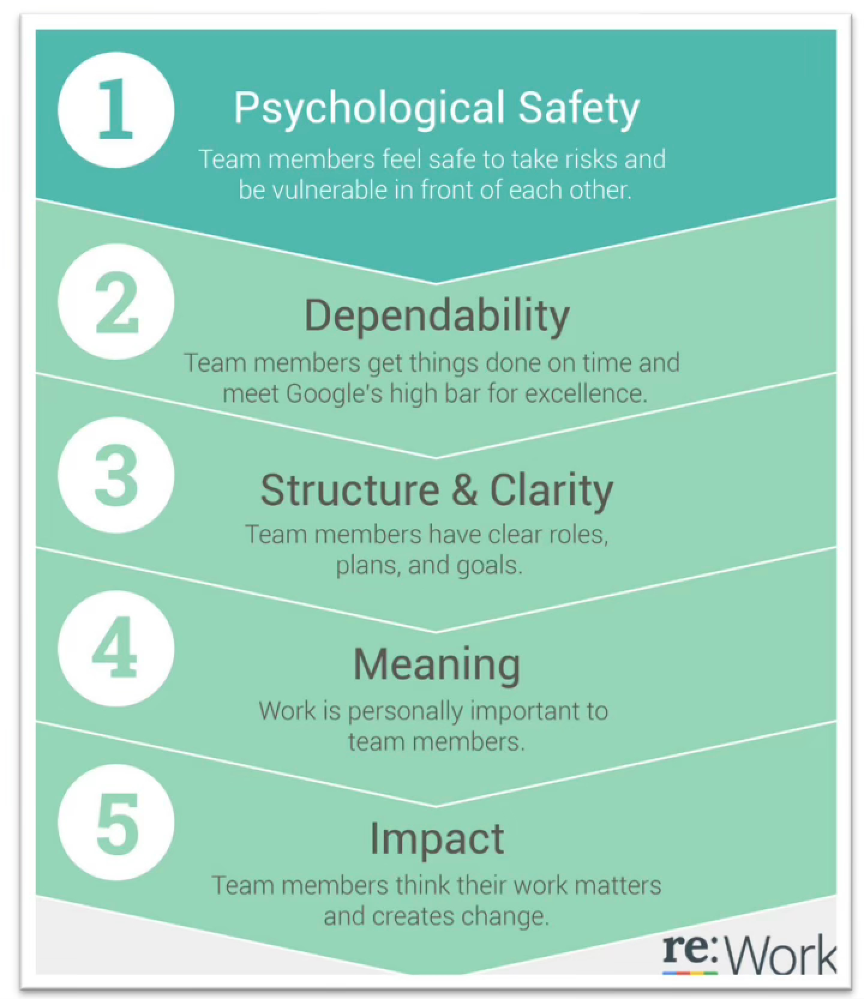

[Re: Work]   谷歌研究影响团队效能的5大要素，发现心理安全居然那么重要！ 

#  介绍

Google 以及许多组织中完成的大部分工作都是由团队协作完成的。团队是实际生产发生的分子单位，是构思和测试创新想法的地方，也是员工体验大部分工作的地方。但人际关系问题、不合适的技能和不明确的团队目标也会阻碍生产力并导致摩擦。

继[Google 的“氧气计划”研究](https://web.archive.org/web/20190401220219/https://rework.withgoogle.com/guides/managers-identify-what-makes-a-great-manager/steps/introduction/)取得成功之后，人员分析团队研究了[如何成为一名优秀的管理者](https://web.archive.org/web/20190401220219/https://rework.withgoogle.com/guides/managers-identify-what-makes-a-great-manager/steps/learn-about-googles-manager-research/)，Google 研究人员应用了类似的方法来发现 Google 高效团队的秘密。代号为“亚里士多德计划”——致敬亚里士多德的名言“整体大于部分之和”（谷歌研究人员认为，员工一起工作比单独工作可以做更多的事情）——目标是回答以下问题：“什么是整体？”让团队在 Google 变得高效？”

阅读[《纽约时报》了解这项工作背后的研究人员：Google 从其构建完美团队的探索中学到了什么](https://web.archive.org/web/20190401220219/http://nyti.ms/20Vn3sz)

# 定义什么是“团队”

回答“什么构成高效团队？”这个问题的第一步就是问“什么是团队？”实际上弄清楚所有一起工作的个人的成员资格、关系和责任不仅仅是一种存在主义的思考练习，这很困难，但对于提高团队效率至关重要。

团队一词可以有多种含义。[存在许多定义和框架](https://web.archive.org/web/20190401220219/http://digitalcommons.ilr.cornell.edu/cgi/viewcontent.cgi?article=1396&context=articles)，具体取决于任务的相互依赖性、组织状态和团队任期。在最基本的层面上，研究人员试图区分“工作组”和“团队”：

 

**工作组****（****work group****）**的特点是相互依赖性最少。它们基于组织或管理层次结构。工作组可以定期召开会议以听取和分享信息。

**团队****（****team****）**是高度相互依赖的——他们计划工作、解决问题、做出决策并审查特定项目的服务进度。团队成员需要彼此才能完成工作。

组织结构图只能说明部分情况，因此 Google 研究团队将重点放在具有真正相互依赖的工作关系的群体上，这由团队本身决定。亚里士多德计划研究的团队成员从三人到五十人不等（平均九人）。

#  定义“效能”（Effectiveness）

一旦了解了谷歌团队的构成，研究人员就必须确定如何定量衡量有效性。他们查看了编写的代码行数、修复的错误、客户满意度等等。但最初推动客观有效性衡量标准的谷歌领导层意识到，每一项建议的衡量标准都可能存在固有缺陷——更多的代码行不一定是好事，修复的错误越多意味着最初会产生更多的错误。

<!-- more -->

相反，团队决定结合使用定性评估和定量测量。对于定性评估，研究人员从三个不同的角度获取了信息——高管、团队领导和团队成员。虽然他们都被要求以相似的标准对团队进行评分，但当被要求解释他们的评分时，他们的答案表明，每个人在评估团队效率时都侧重于不同的方面。

高管们最关心的是结果（例如销售数字或产品发布），但团队成员表示团队文化是衡量团队效率的最重要指标。团队领导的有效性概念恰如其分地涵盖了大局和个人的担忧，并表示所有权、愿景和目标是最重要的衡量标准。

因此，研究人员通过四种不同的方式衡量团队效率：

\1. 高管对团队的评价

\2. 组长对团队的评价

\3. 团队成员对团队的评价

\4. 季度销售业绩对比

定性评估有助于对结果和文化进行细致入微的审视，但具有固有的主观性。另一方面，定量指标提供了具体的团队衡量标准，但缺乏情境考虑。然而，这四项措施的结合使研究人员能够深入了解团队有效性的全面定义。

# 收集数据并衡量有效性

根据全球高管的意见，研究团队确定了 180 个团队进行研究（115 个工程项目团队和 65 个销售团队），其中包括高绩效和低绩效团队。该研究测试了团队构成（例如，性格特征、销售技能、团队人口统计）和团队动态（例如，与队友合作的感觉）如何影响团队效率。想法来自于现有的研究以及谷歌自己关于如何打造高效团队的经验。

他们对领导者进行了数百次[双盲](https://web.archive.org/web/20190401220219/https://en.wikipedia.org/wiki/Blind_experiment)访谈，以了解他们认为推动团队效率的因素。然后，研究人员查看了现有的调查数据，包括来自年度员工敬业度调查和 gDNA（[谷歌关于工作和生活的纵向研究）的](https://web.archive.org/web/20190401220219/https://hbr.org/2014/03/googles-scientific-approach-to-work-life-balance-and-much-more/)250 多个项目，以了解哪些变量可能与有效性相关。以下是研究中使用的一些示例项目，要求参与者同意或不同意：

· **团队****动态****：**我可以放心地向团队表达不同的意见。

· **技能组合：**我擅长克服障碍。

· **人格特质：**我认为自己是一个可靠的工人（根据[大五人格评估](https://web.archive.org/web/20190401220219/https://www.ocf.berkeley.edu/~johnlab/bfi.htm)得出）。

· **情商：**我对其他人的问题不感兴趣（根据[多伦多同理心问卷](https://web.archive.org/web/20190401220219/http://www.ncbi.nlm.nih.gov/pmc/articles/PMC2775495/)得知）。

还收集了任期、级别和地点等人口统计变量。

# 确定有效团队的动态

利用所有这些数据，团队运行了统计模型，以了解收集的众多输入中的哪些实际上影响了团队的效率。他们对数百个变量使用超过 35 个不同的统计模型，试图找出以下因素：

· 影响定性和定量的多个结果指标

· 为整个组织中不同类型的团队提供信息

· 显示出一致、稳健的统计显着性

**研究人员发现，真正重要的不是团队成员，而是团队如何合作。**按重要性排序：

· **心理安全：**[心理安全是指个人对承担人际风险的后果的看法](#page_scan_tab_contents)，或认为团队在面临被视为无知、无能、消极或破坏性的情况下冒险是安全的。在一个心理安全度较高的团队中，队友在团队成员周围冒险时会感到安全。他们相信团队中没有人会因为承认错误、提出问题或提出新想法而让其他人感到尴尬或惩罚。

· **可靠性：**在可靠的团队中，[成员能够按时可靠地完成高质量的工作](https://web.archive.org/web/20190401220219/http://amj.aom.org/content/53/3/535.short)（而不是相反 -[逃避责任](https://web.archive.org/web/20190401220219/http://www.jstor.org/stable/pdf/258490.pdf?acceptTC=true)）。

· **结构和清晰度：**[个人对工作期望的理解、实现这些期望的过程](https://web.archive.org/web/20190401220219/http://www.jstor.org/stable/1556372)以及个人绩效的后果对于团队效率非常重要。目标可以在个人或团体层面设定，并且必须具体、具有挑战性且可实现。 [Google 经常使用目标和关键结果 (OKR)](https://web.archive.org/web/20190401220219/https://rework.withgoogle.com/guides/set-goals-with-okrs/steps/introduction/)来帮助设定和传达短期和长期目标。

· **意义****：**在工作本身或产出中找到目标感对于团队效率非常重要。工作的意义是针对个人的，并且可能会有所不同：例如，经济保障、支持家庭、帮助团队成功或每个人的自我表达。

· **影响：**一个人的工作成果，[即你的工作正在发挥作用的主观判断，对团队来说很重要](https://web.archive.org/web/20190401220219/http://www.ncbi.nlm.nih.gov/pubmed/18211139)。看到一个人的工作正在为组织的目标做出贡献可以帮助揭示影响力。

 

 

研究人员还发现哪些变量与谷歌团队的效率没有显著的相关性：

· 队友同地办公（坐在同一个办公室）

· 共识驱动的决策

· 团队成员的外向性

· 团队成员的个人表现

· 工作负载大小

· 资历

· 团队规模

· 终身教职

值得注意的是，虽然这些变量并没有对谷歌的团队效率衡量产生显着影响，但这并不意味着它们在其他地方不重要。例如，虽然团队规模在 Google 分析中并未突出，[但有大量研究表明它的重要性](https://web.archive.org/web/20190401220219/https://rework.withgoogle.com/blog/many-hands-may-not-make-light-work/)。许多研究人员发现，较小的团队（成员少于 10 人）比大型团队更有利于团队成功（ [Katzenbach & Smith，1993](https://web.archive.org/web/20190401220219/https://books.google.com/books/about/The_Wisdom_of_Teams.html?id=FMJn4RmmiAkC) ； [Moreland、Levine 和 Wingert，1996）](https://web.archive.org/web/20190401220219/http://goo.gl/5kQS8l) 。较小的团队也能体验到更好的工作与生活质量（ [Campion）等，1993](https://web.archive.org/web/20190401220219/http://onlinelibrary.wiley.com/doi/10.1111/j.1744-6570.1993.tb01571.x/abstract) ），工作成果（ [Aube 等，2011](https://web.archive.org/web/20190401220219/http://psycnet.apa.org/psycarticles/2011-21070-001) ），更少的冲突，更强的沟通，更多的凝聚力（ [Moreland & Levine，1992](https://web.archive.org/web/20190401220219/http://www.amazon.com/Advances-Group-Processes-9-1992/dp/1559385162) ； [Mathieu 等，2008](https://web.archive.org/web/20190401220219/http://jom.sagepub.com/content/34/3/410.abstract) ），以及更多的组织公民行为（ [Pearce 和 Herbik](https://web.archive.org/web/20190401220219/http://www.ncbi.nlm.nih.gov/pubmed/15168430) ） [，2004](https://web.archive.org/web/20190401220219/http://www.ncbi.nlm.nih.gov/pubmed/15168430) ）。

# 工具：帮助团队确定自己的需求

除了传达研究结果之外，谷歌研究团队还希望让谷歌员工了解自己团队的动态并提供改进建议。因此，他们创建了一项调查供团队进行并相互讨论。调查项目侧重于五个有效性支柱和问题，包括：

· 心理安全——“如果我在团队中犯了错误，我不会受到惩罚。”

· 可靠性——“当我的队友说他们会做某事时，他们就会坚持到底。”

· 结构和清晰度 - “我们的团队拥有有效的决策流程。”

· 意义 - “我为团队所做的工作对我来说很有意义。”

· 影响 - “我了解我们团队的工作如何为组织的目标做出贡献。”

完成调查后，团队领导会收到汇总的匿名分数，以便与团队成员分享并为讨论提供信息。人员运营协调员通常会加入讨论，或者团队负责人将遵循人员运营团队创建的讨论指南。

 

**团队效率讨论指南**

本讨论指南重点关注 Google 认为对团队效率非常重要的五种团队动力。该指南可以帮助团队确定他们可能想要改进的领域，并引出如何做到这一点的想法。

[下载 PDF](https://web.archive.org/web/20190401220219/https:/docs.google.com/document/d/1lgiz6mwZeyWEaJxN_NMI-tI5Qijv2BHh27DPLeSLE40/export?format=pdf) [打开为 Google 文档](https://web.archive.org/web/20190401220219/https:/docs.google.com/document/d/1lgiz6mwZeyWEaJxN_NMI-tI5Qijv2BHh27DPLeSLE40/edit)

# 工具：促进心理安全

在研究人员确定的有效团队的五个关键动力中，心理安全是迄今为止最重要的。谷歌研究人员发现，心理安全感较高的团队中的个人离开谷歌的可能性较小，他们更有可能利用队友不同想法的力量，带来更多收入，而且他们的效率被评为是其他人的两倍。通常由高管执行。

哈佛大学的组织行为科学家[艾米·埃德蒙森（Amy Edmondson）](https://web.archive.org/web/20190401220219/http://www.hbs.edu/faculty/Pages/profile.aspx?facId=6451&facInfo=pub)首先[提出了“团队心理安全”的概念](https://web.archive.org/web/20190401220219/http://www.jstor.org/stable/2666999)，并将其定义为“团队成员所持有的共同信念，即团队在人际冒险方面是安全的”。在团队成员周围冒险听起来可能很简单。但要问一个基本问题，例如“这个项目的目标是什么？”可能会让你听起来像是脱离了圈子。在没有得到澄清的情况下继续下去可能会感觉更容易，以避免被视为无知。

为了衡量团队的心理安全水平，埃德蒙森询问团队成员对这些陈述的同意或不同意程度：

\1. 如果你在这个团队中犯了错误，通常会受到指责。

\2. 该团队的成员能够提出问题和棘手问题。

\3. 这个团队中的人有时会因为其他人与众不同而拒绝他们。

\4. 在这个团队中冒险是安全的。

\5. 向这个团队的其他成员寻求帮助是很困难的。

\6. 这个团队中没有人会故意做出破坏我努力的行为。

\7. 与这个团队的成员一起工作，我独特的技能和才能得到了重视和利用。

在[她的 TEDx 演讲](https://web.archive.org/web/20190401220219/https://youtu.be/LhoLuui9gX8)中，埃德蒙森提出了个人可以做的三件简单的事情来促进团队心理安全：

\1. 将工作视为学习问题，而不是执行问题。

\2. 承认自己的错误。

\3. 树立好奇心并提出很多问题。

（视频链接：

[https://web.archive.org/web/20190401220219if_/https://www.youtube.com/embed/LhoLuui9gX8）](https://web.archive.org/web/20190401220219if_/https:/www.youtube.com/embed/LhoLuui9gX8）)

为了在内部推广谷歌的研究成果，研究团队一直在与团队举办研讨会。在研讨会上，匿名场景被用来说明可以支持和损害心理安全的行为。这些场景是角色扮演的，然后是小组汇报。这是一个示例场景：

 

心理安全情景 | 创意与创新

Uli是一位长期担任经理的人，以其技术专长而闻名。在过去的两年里，他担任 XYZ 团队的经理，负责运行一个大型项目。他坚持非常高的标准，但在过去的几个月里，Uli变得越来越不能容忍错误、他认为“低于标准”的想法以及对他的思维方式的挑战。

最近，Uli 公开“驳斥”了一位经验丰富的团队成员提出的想法，并在背后对更广泛的团队成员发表了非常负面的言论。其他人都认为这个想法很强大、经过充分研究并且值得探索。从那以后，想法就枯竭了。

Uli 的想法推动了最近的项目提案，但最终被高管拒绝，因为它缺乏创造力和创新性。

 汇报问题：

· 您认为哪些行为反映了心理安全？

· 哪些行为可能表明该场景中缺乏心理安全？

· 为什么心理安全如此重要？它在团队中有何不同？你在你的 			团队中看到了什么？

如果您是经理，请在[指导](https://web.archive.org/web/20190401220219/https://rework.withgoogle.com/guides/managers-coach-managers-to-coach/steps/introduction/)团队成员和队友时考虑这些建议。

 

**经理心理安全行动**

本指南可以帮助管理者思考如何塑造和加强团队的心理安全感。基于研究，本指南为经理和团队成员提供了可行的建议，以帮助创建每个人都可以做出贡献的团队环境。

[下载 PDF](https://web.archive.org/web/20190401220219/https:/docs.google.com/document/d/1PsnDMS2emcPLgMLFAQCXZjO7C4j2hJ7znOq_g2Zkjgk/export?format=pdf) [打开为 Google 文档](https://web.archive.org/web/20190401220219/https:/docs.google.com/document/d/1PsnDMS2emcPLgMLFAQCXZjO7C4j2hJ7znOq_g2Zkjgk/edit)

#  帮助团队采取行动

谷歌研究人员确定的有效团队的五个关键动力植根于更广泛的团队绩效研究领域。无论您是在 Google 编码、[在作家室里即兴发挥](https://web.archive.org/web/20190401220219/https://youtu.be/3AuVv1ydWZ4?list=PLfjGR5Brkh9gi3rhQLC9qoWP3VBqXaQJK)、[准备火星之旅](https://web.archive.org/web/20190401220219/https://www.youtube.com/watch?v=cviVwBeCPqA&feature=youtu.be)，还是[在曲棍球场上滑冰](https://web.archive.org/web/20190401220219/https://youtu.be/Sy6-qJmqz3w?list=PLfjGR5Brkh9gi3rhQLC9qoWP3VBqXaQJK)，团队对于工作经验和产出都至关重要。在谷歌，既然亚里士多德项目团队已经确定了谷歌高效团队的要素，他们正在进行研究，以找出如何采取下一步措施来创建、培养和授权高效团队。

无论是什么让您的组织中的团队变得高效，并且可能与 Google 研究人员的发现有所不同，请考虑以下步骤来分享您的努力：

**1.** ***\*建立通用词汇\*******\*表\****- 定义您想要在组织中培养的团队行为和规范。

**2.** ***\*创建一个论坛来讨论团队动态\****- 允许团队以安全、建设性的方式讨论微妙的问题。人力资源业务合作伙伴或经过培训的协调员可能会有所帮助。

**3.** ***\*让领导者致力于加强和改进\****- 让领导者参与建模并寻求持续改进可以帮助您将词汇付诸实践。

 

 

以下是一些为管理者和领导者提供的建议，以支持谷歌研究人员认为对高效团队很重要的行为。这些基于外部研究和 Google 自身的经验：

###  心理安全：

· 征求小组的意见和建议。

· 分享有关个人和工作风格偏好的信息，并鼓励其他人也这样做。

· 观看[Amy Edmondson 关于心理安全的 TED 演讲](https://web.archive.org/web/20190401220219/https://youtu.be/LhoLuui9gX8)。

###  可靠性：

· 明确团队成员的角色和职责。

· 制定具体的项目计划，为每个人的工作提供透明度。

· 谈谈一些关于[责任心的研究](https://web.archive.org/web/20190401220219/http://www.businessinsider.com/conscientiousness-predicts-success-2014-4)。

###  结构和清晰度：

· 定期沟通团队目标并确保团队成员了解实现这些目标的计划。

· 确保您的团队会议有明确的议程和指定的领导者。

· 考虑采用[目标和关键结果 (OKR)](https://web.archive.org/web/20190401220219/https://rework.withgoogle.com/guides/set-goals-with-okrs/steps/introduction/)来组织团队的工作。

###  意义：

· 为团队成员正在做的出色的事情提供积极的反馈，并帮助他们解决遇到的困难。

· 公开表达对帮助你的人的感激之情。

· [有目的地阅读毕马威案例研究。](https://web.archive.org/web/20190401220219/https://rework.withgoogle.com/case-studies/KPMG-purpose/)

###  影响：

· 共同创建清晰的愿景，强化每个团队成员的工作如何直接为团队和更广泛的组织目标做出贡献。

· 反思您正在做的工作以及它如何影响用户或客户和组织。

· 采用以用户为中心的评价方法，以用户为中心。

 

This content is from [rework.withgoogle.com](https://web.archive.org/web/20190401220219/http://rework.withgoogle.com/) (the "Website") and may be used for non-commercial purposes in accordance with the terms of use set forth on the Website.

https://web.archive.org/web/20190401220219/https://rework.withgoogle.com/print/guides/5721312655835136/
